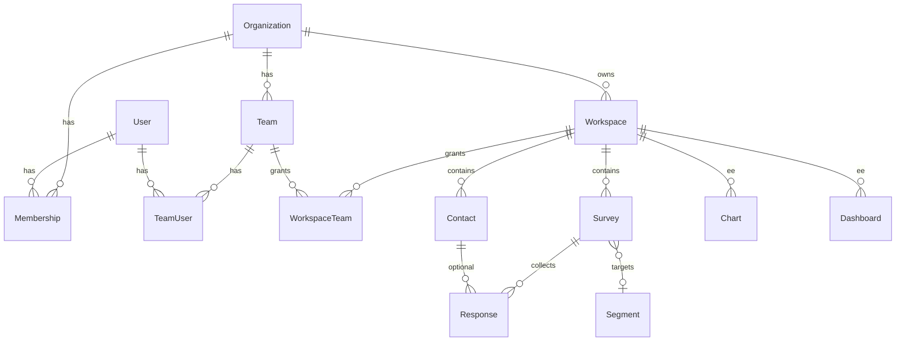

# Research Platform Architecture (Formbricks fork)

> **Этап 0 — аудит и архитектура.**  
> Документ зафиксирован по состоянию репозитория Formbricks `main` (снимок от 2026-07-17).  
> **Этап 1 (2026-07-17):** Research Projects (`ResearchClient` / `ResearchBrand`).  
> **Этап 2 (2026-07-17):** Interviews & Insights.  
> **Этап 3 (2026-07-17):** Analysis Workspace — `ResearchDataset`, `ResearchAnalysisBlock`, ChartDefinition.  
> **Этап 4 (2026-07-18):** Report Builder — `ResearchReport`, blocks, versions, themes, DnD editor.  
> **Этап 5 (2026-07-18):** PDF Export — `ResearchExportJob`/`Artifact`, print HTML, Playwright, BullMQ `research.export.pdf`.  
> **Этап 6 (2026-07-18):** Excel Export — ExcelJS multi-sheet, formula injection sanitize, BullMQ `research.export.xlsx`.  
> **Этап 7 (2026-07-18):** Brand Audit — criteria template, assessments, radar/SWOT/matrices, report embed.

---

## 1. Вердикт аудита

Formbricks уже даёт устойчивую основу для внутренней research-платформы:

| Нужно агентству | Есть в Formbricks | Стратегия |
|-----------------|-------------------|-----------|
| Опросы и ответы | `Survey`, `Response`, конструктор, публичные ссылки | Переиспользовать без дублирования |
| Пользователи / орг / доступы | `User`, `Organization`, `Membership`, `Team`, `Workspace` + better-auth | Расширить, не заменять |
| Файлы | `@formbricks/storage` (S3 signed URLs) | Переиспользовать для Research Assets / экспортов |
| Фоновые задачи | `@formbricks/jobs` (BullMQ + Redis/Valkey) | Добавить job-типы для PDF/XLSX |
| Аналитика опросов | Summary (NPS/CSAT/CES) + EE Cube dashboards | Research-слой поверх Summary; Cube — опционально |
| CSV/XLSX ответов | `@json2csv/node` + vendored `xlsx` + formula injection defense | Расширить до отчётного Excel |
| UI / i18n | Radix + Tailwind (`modules/ui`), `ru-RU` уже есть | Сохранить визуальный язык |
| PDF-отчёты, интервью, Insights, Client/Brand, Report builder | **Отсутствуют** | Новые изолированные модули |

**Ключевое переименование относительно старых описаний Formbricks:**  
`Environment` / `Product` → **`Workspace`**, `Person` → **`Contact`**. В новых сущностях и UI используем актуальную терминологию.

---

## 2. Найденный технологический стек

### 2.1 Monorepo

| Параметр | Значение |
|----------|----------|
| Package manager | **pnpm 11.7.0** (`packageManager` в root `package.json`) |
| Workspaces | `apps/*`, `packages/*`, `docker` (`pnpm-workspace.yaml`) |
| Orchestration | **Turbo 2.9.14** |
| Node | `>=20.19 <21 \|\| >=22.12 <23 \|\| >=24 <25` (engines); `.nvmrc` = **24.14.0** |
| Root version | `0.0.0` (semver продукта в репозитории не зафиксирован отдельным `VERSION`) |

### 2.2 Приложения

| App | Назначение |
|-----|------------|
| `apps/web` | Основное Next.js-приложение (App Router) |
| `apps/storybook` | Storybook для UI |

### 2.3 Пакеты (`packages/`)

| Пакет | Назначение |
|-------|------------|
| `@formbricks/database` | Prisma schema, клиент, миграции |
| `@formbricks/types` | Общие Zod/TS типы |
| `@formbricks/storage` | S3-совместимое хранилище |
| `@formbricks/jobs` | BullMQ job definitions / runtime |
| `@formbricks/cache` | Redis cache |
| `@formbricks/logger` | Логирование |
| `@formbricks/email` | Письма |
| `@formbricks/surveys` / `survey-ui` / `js-core` | Виджеты и runtime опросов |
| `@formbricks/ai` | AI SDK providers (не обязателен для MVP research) |
| `@formbricks/i18n-utils` | Утилиты i18n |
| config-* | ESLint / Prettier / TypeScript |

Внешний пакет `@formbricks/hub` (0.9.0) — Feedback Hub (отдельная БД `HUB_DATABASE_URL`, embeddings/sentiment).

### 2.4 Runtime-стек `apps/web`

| Слой | Технология |
|------|------------|
| Framework | **Next.js 16.2.6** (Turbopack в dev) |
| UI | **React 19.2.6** |
| Auth | **better-auth 1.6.18** (+ OAuth, 2FA, SAML/SSO в EE) |
| ORM | **Prisma 7.8.0** + `@prisma/adapter-pg` + PostgreSQL |
| Validation | **Zod 4.3.6** |
| Server actions | **next-safe-action 8.1.10** (`authenticatedActionClient`) |
| Styles | **Tailwind CSS 4.3.1** + Radix UI + CVA |
| Charts (UI) | **Recharts 2.15.3** |
| DnD | **@dnd-kit/** |
| Rich text | **Lexical 0.41.0** |
| Tables | **@tanstack/react-table** |
| Data fetching | **@tanstack/react-query** |
| Analytics (EE) | **Cube.js** (`@cubejs-client/core` + docker `cube`) |
| CSV | `@json2csv/node` |
| XLSX | vendored `xlsx@0.20.3` (`apps/web/vendor/xlsx-0.20.3.tgz`) |
| Images | `sharp` |
| Jobs | BullMQ 5.61 + ioredis |
| Observability | OpenTelemetry, Sentry, structured logger |
| i18n | i18next + react-i18next + lingo.dev; локаль **`ru-RU` уже есть** |
| Tests | Vitest 4.1.6 (unit/integration), Playwright 1.58.2 (e2e) |

### 2.5 Инфраструктура (dev)

Из `docker-compose.dev.yml`:

- **PostgreSQL** — `pgvector/pgvector:pg18`
- **Valkey** (Redis-compatible) — очередь/кэш
- **RustFS** — S3-compatible object storage (dev)
- **Mailhog** — почта
- **Cube** — аналитика Unify Feedback
- **Hub** — отдельный сервис + `HUB_DATABASE_URL`

Обязательные env (фрагмент): `DATABASE_URL`, `REDIS_URL`, `ENCRYPTION_KEY`, `NEXTAUTH_SECRET` / `BETTER_AUTH_SECRET`, `CRON_SECRET`, S3_* для файлов.

---

## 3. Важные директории

```
formbricks/
├── apps/web/
│   ├── app/                          # App Router (routes)
│   │   ├── (app)/workspaces/[workspaceId]/
│   │   │   ├── surveys/              # CRUD + analysis/summary/responses
│   │   │   ├── contacts/
│   │   │   ├── (analysis)/           # EE charts & dashboards
│   │   │   └── components/MainNavigation.tsx
│   │   ├── api/                      # REST (v1/v2/v3), auth, storage
│   │   └── storage/                  # File serve routes
│   ├── modules/
│   │   ├── ui/                       # Design system (Radix + Tailwind)
│   │   ├── auth/                     # better-auth
│   │   ├── survey/, storage/, analysis/, organization/, workspaces/
│   │   └── ee/                       # Enterprise (отдельная лицензия!)
│   ├── lib/                          # services, auth helpers, utils
│   │   ├── utils/action-client/      # safe actions + RBAC middleware
│   │   ├── response/                 # response service + CSV/XLSX export
│   │   └── utils/file-conversion.ts  # CSV/XLSX + formula injection sanitize
│   └── locales/                      # en-US, ru-RU, …
├── packages/database/schema.prisma
├── packages/storage/                 # S3 signed upload/download
├── packages/jobs/                    # BullMQ definitions
├── docker/                           # prod compose, cube schema, rustfs-init
└── docs/                             # продукт-доки + этот документ
```

---

## 4. Текущая доменная модель (переиспользуемое)

### 4.1 Иерархия доступа

```
Organization
  ├── Membership (role: owner | manager | member | billing)
  ├── Team → TeamUser (admin | contributor)
  └── Workspace
        ├── WorkspaceTeam (read | readWrite | manage)
        ├── Survey → Response (+ Contact?, Tag)
        ├── Segment (targeting, не analytics cross-tab)
        ├── Chart / Dashboard / DashboardWidget  (EE, Cube / feedback_records)
        └── FeedbackSource* (Unify Hub pipeline)
```

### 4.2 Что переиспользуем напрямую

| Сущность / механизм | Путь / модель | Использование в research |
|---------------------|---------------|--------------------------|
| Organization | `Organization` | Тенант агентства |
| Workspace | `Workspace` | Контейнер клиентских/внутренних опросов (или один shared workspace) |
| User / Membership / Team | schema + `checkAuthorizationUpdated` | Базовый доступ; research-роли — поверх |
| Survey / Response | schema + summary + export | Количественные исследования |
| Contact | `Contact` + attributes | Опциональная связка респондентов опросов |
| Tag / TagsOnResponses | schema | Частично для quant; qualitative codes — отдельно |
| Storage | `@formbricks/storage` | Assets, media интервью, артефакты экспорта |
| Jobs | `@formbricks/jobs` | PDF/XLSX generation |
| Summary analytics | `surveySummary.ts`, NPS/CSAT/CES UI | Базовый quant-слой |
| Formula injection defense | `file-conversion.ts` | Перенести в Excel export отчётов |
| UI kit | `modules/ui` | Все новые экраны |
| i18n | locales + lingo | RU/EN интерфейс |
| Audit logs | EE `modules/ee/audit-logs` | Расширить targets **или** свой audit trail в research (см. риски EE) |
| Lexical / dnd-kit / recharts | deps | Plan editor, report builder, charts |

### 4.3 ER (текущее ядро, упрощённо)



### 4.4 Что сознательно НЕ смешиваем с research core

- **Unify Feedback Hub / Cube / FeedbackDirectory** — мощный, но EE + отдельная БД + license gate. Не делаем research MVP зависимым от Cube. Можно позже подключить как дополнительный datasource.
- **Billing / Stripe / trial banners** — для внутреннего агентства обычно отключаются/игнорируются; не трогаем без нужды.
- **In-app / website survey widgets** — остаются; research в первую очередь link surveys + interviews.

---

## 5. Точки расширения (extension points)

| Точка | Файл / область | Тип изменения |
|-------|----------------|---------------|
| Главная навигация | `MainNavigation.tsx` | Добавить раздел «Исследования» |
| Локали | `apps/web/locales/*.json` | Ключи research |
| Prisma | `packages/database/schema.prisma` + migration | Новые модели |
| Zod types | `packages/types` или `modules/research/types` | Валидация |
| Server actions | `authenticatedActionClient` + `checkAuthorizationUpdated` | API слой |
| Jobs | `packages/jobs` definitions + `instrumentation-jobs.ts` | Export jobs |
| Storage routes | `modules/storage` | Prefixes для research assets/exports |
| Feature flags | новый флаг / org setting | Поэтапный rollout |

Минимизировать правки в survey editor, response pipeline, better-auth core.

---

## 6. Новые сущности и модель данных

### 6.1 Принципы моделирования

1. **Research живёт на уровне Organization** (агентство), с опциональной привязкой к `Workspace` для опросов.
2. **Survey не копируем** — связь many-to-many `ResearchProjectSurvey`.
3. **JSON там, где структура гибкая и редко фильтруется**; отдельные таблицы — где нужны индексы, ACL, связи, полнотекст, версии.
4. **Soft delete / archive** для ResearchProject, Report, Interview (по образцу `FeedbackDirectory.isArchived`).
5. **Версионирование** только для Report (и опционально Research Plan snapshots).

### 6.2 Нормализованная модель (MVP → full)

#### Отдельные таблицы (обязательно)

| Модель | Зачем таблица |
|--------|---------------|
| `Client` | Фильтры списка, связи Brand/Project, логотип |
| `Brand` | Фильтры, аудит, материалы |
| `ResearchProject` | Главная сущность; статус, даты, owner |
| `ResearchProjectMember` | ACL внутри проекта + research-роли |
| `ResearchProjectSurvey` | Связь с существующими Survey |
| `Interview` | Качественные исследования |
| `Transcript` / `TranscriptSegment` | Поиск, coding, цитаты |
| `ResearchCode` / `TranscriptSegmentCode` | Coding workspace |
| `ResearchAsset` | Файлы/ссылки (метаданные; blob в S3) |
| `Insight` / `InsightEvidence` | Структурированные выводы + доказательства |
| `AnalysisBlock` | Сохранённая конфигурация визуализации (не картинка) |
| `Report` / `ReportBlock` / `ReportVersion` | Конструктор + история |
| `ReportTheme` | Фирменные темы агентства/клиента |
| `ExportJob` / `ExportArtifact` | Статус PDF/XLSX, путь в S3 |
| `BrandAudit` / `BrandAuditCriterion` / `BrandAuditAssessment` | Модуль бренд-аудита |
| `ResearchActivity` | Activity feed / audit trail research (без зависимости от EE) |

#### JSON-поля (допустимо)

| Поле | Где | Почему JSON |
|------|-----|-------------|
| `plan` | ResearchProject или `ResearchPlanRevision` | Гибкие секции плана, порядок блоков, автосейв |
| `goals`, `researchQuestions`, `hypotheses` | ResearchProject | Списки структурированных объектов; на Этапе 1 можно JSON, позже нормализовать при необходимости фильтров |
| `methodology` | ResearchProject | Описание + выбранные method enums |
| `audience` / `segments` | ResearchProject | Описание выборки |
| `chartDefinition` | AnalysisBlock | Единый ChartDefinition |
| `layout` / `content` | ReportBlock | Контент блока редактора |
| `themeTokens` | ReportTheme | Цвета, шрифты, footer |
| `exportOptions` | Report | A4 orientation, include TOC, … |
| `criteriaTemplate` | BrandAudit | Набор критериев шаблона |

#### Версии

| Сущность | Версии |
|----------|--------|
| Report | `ReportVersion` — полный snapshot блоков + themeId + author + createdAt |
| Research Plan | опционально `ResearchPlanRevision` с Этапа 2+ |
| AnalysisBlock | `updatedAt` + config; без полной history в MVP |
| ExportArtifact | иммутабельный файл + hash входных данных |

#### Полнотекстовый поиск

| Область | Подход |
|---------|--------|
| Transcript / segments | Postgres `tsvector` / `pg_trgm` на `TranscriptSegment.text` |
| Insights | `tsvector` на title+description |
| Research projects list | ILIKE + индексы по status/client/brand; later FTS |
| Cross-project semantic search | Позже через Hub embeddings — **не MVP** |

#### Индексы (минимум)

- `ResearchProject(organizationId, status, updatedAt)`
- `ResearchProject(clientId)`, `(brandId)`, `(ownerId)`
- `ResearchProjectMember(userId, researchProjectId)` unique
- `Interview(researchProjectId, status, scheduledAt)`
- `TranscriptSegment(transcriptId, position)`
- `TranscriptSegmentCode(codeId)`, `(segmentId)`
- `Insight(researchProjectId, type, importance)`
- `Report(researchProjectId, status)`
- `ExportJob(status, createdAt)`, `(reportId)`
- `ResearchAsset(researchProjectId, type)`

### 6.3 Предлагаемая схема (логический черновик)

> Имена и enum'ы будут уточнены в миграции Этапа 1 в стиле Prisma-проекта (`@map`, cuid, cascade).

```prisma
enum ResearchProjectStatus {
  draft
  planning
  recruiting
  fieldwork
  analysis
  reporting
  completed
  archived
}

enum ResearchMemberRole {
  owner
  admin
  research_lead
  researcher
  analyst
  viewer
}

enum ResearchMethodType {
  quantitative_survey
  depth_interview
  expert_interview
  focus_group
  brand_audit
  desk_research
  competitive_analysis
  review_analysis
  concept_test
  name_test
  identity_test
  brand_perception
}

enum InterviewStatus {
  planned
  scheduled
  completed
  transcribed
  coded
  analyzed
}

enum InsightType {
  finding
  pattern
  tension
  need
  motivation
  barrier
  opportunity
  hypothesis
  recommendation
}

enum ReportStatus {
  draft
  in_review
  approved
  published
  archived
}

enum ExportJobType {
  pdf
  xlsx
}

enum ExportJobStatus {
  queued
  processing
  completed
  failed
  cancelled
}

model Client {
  id             String   @id @default(cuid())
  organizationId String
  name           String
  logoUrl       String?
  industry       String?
  website        String?
  description    String?
  contacts       Json     @default("[]") // [{name,email,role}]
  createdAt      DateTime @default(now())
  updatedAt      DateTime @updatedAt
  brands         Brand[]
  projects       ResearchProject[]
  @@index([organizationId, name])
}

model Brand {
  id             String   @id @default(cuid())
  organizationId String
  clientId       String?
  name           String
  logoUrl        String?
  website        String?
  description    String?
  market         String?
  competitors    Json     @default("[]")
  createdAt      DateTime @default(now())
  updatedAt      DateTime @updatedAt
  client         Client?  @relation(...)
  projects       ResearchProject[]
  audits         BrandAudit[]
  @@index([organizationId, name])
  @@index([clientId])
}

model ResearchProject {
  id               String                 @id @default(cuid())
  organizationId   String
  workspaceId      String?                // optional default workspace for new surveys
  clientId         String?
  brandId          String?
  name             String
  description      String?
  researchType     String?                // free label + methods[]
  status           ResearchProjectStatus  @default(draft)
  ownerId          String
  startsAt         DateTime?
  endsAt           DateTime?
  isFavorite       Boolean                @default(false)
  plan             Json                   @default("{}")
  goals            Json                   @default("[]")
  researchQuestions Json                  @default("[]")
  hypotheses       Json                   @default("[]")
  methods          ResearchMethodType[]
  audience         Json                   @default("{}")
  createdAt        DateTime               @default(now())
  updatedAt        DateTime               @updatedAt
  archivedAt       DateTime?
  // relations: members, surveys, interviews, assets, insights, analysisBlocks, reports, activities, brandAudits
  @@index([organizationId, status, updatedAt])
  @@index([clientId])
  @@index([brandId])
  @@index([ownerId])
}

model ResearchProjectMember {
  id                String             @id @default(cuid())
  researchProjectId String
  userId            String
  role              ResearchMemberRole
  createdAt         DateTime           @default(now())
  @@unique([researchProjectId, userId])
  @@index([userId])
}

model ResearchProjectSurvey {
  id                String   @id @default(cuid())
  researchProjectId String
  surveyId          String
  addedById         String?
  createdAt         DateTime @default(now())
  @@unique([researchProjectId, surveyId])
  @@index([surveyId])
}
```

Остальные модели (`Interview`, `Transcript*`, `Insight*`, `AnalysisBlock`, `Report*`, `Export*`, `BrandAudit*`) вводятся на Этапах 2–7 по roadmap; на Этапе 1 достаточно Client/Brand/ResearchProject/Member/Survey link + Activity.

### 6.4 Таблица vs JSON — краткие решения

| Кандидат из ТЗ | Решение |
|----------------|---------|
| ResearchQuestion / ResearchHypothesis | **JSON в MVP** на проекте; нормализовать, если появятся cross-project queries |
| ResearchMethod | **enum array** на проекте + шаблоны планов |
| Dataset / DatasetField | **Этап 3**: таблица `Dataset` для CSV/XLSX imports; survey responses — virtual dataset поверх Survey |
| SavedAnalysisView | Можно слить с `AnalysisBlock` (saved config) |
| InterviewParticipant | Поле/JSON на Interview в MVP; таблица — если нужна CRM респондентов |
| ReportSection | Опционально: секции = блоки типа `heading` + nesting в `ReportBlock.parentId` |

---

## 7. Архитектура модулей

### 7.1 Предлагаемая структура директорий

Новый код — **изолированный модуль**, не внутри `modules/ee`:

```
apps/web/modules/research/
  ├── types/                 # Zod schemas, ChartDefinition, enums
  ├── lib/
  │   ├── authorization.ts   # research RBAC (server)
  │   ├── projects/          # repositories + services
  │   ├── interviews/
  │   ├── insights/
  │   ├── analysis/          # aggregation, chart defs
  │   ├── reports/
  │   ├── brand-audit/
  │   ├── export/            # pdf/xlsx orchestrators
  │   └── activity/
  ├── actions/               # next-safe-action wrappers
  ├── components/            # UI (list, tabs, editors)
  └── hooks/

apps/web/app/(app)/workspaces/[workspaceId]/research/
  ├── page.tsx               # list
  ├── new/page.tsx
  └── [researchProjectId]/
        ├── layout.tsx       # tabs shell
        ├── page.tsx         # Overview
        ├── plan/
        ├── surveys/
        ├── interviews/
        ├── materials/
        ├── analysis/
        ├── insights/
        ├── reports/
        ├── activity/
        └── settings/

packages/database/…          # Prisma models + migrations
packages/jobs/…              # research.export.pdf / .xlsx
packages/types/research/…    # optional shared types
```

Альтернатива размещения list на org-level (`/organizations/.../research`) допустима, но **workspace-scoped routes** лучше стыкуются с текущим `MainNavigation` и workspace layout. `ResearchProject.organizationId` остаётся источником истины для ACL; `workspaceId` — UX-контекст и default для новых Surveys.

### 7.2 Слои ответственности

```
UI (modules/research/components)
  → actions (authenticatedActionClient + Zod)
    → authorization (org membership AND research member role)
      → services (business rules, transactions)
        → prisma / storage / jobs
```

Бизнес-логика **не** в React-компонентах.

### 7.3 RBAC для research

Существующие org roles (`owner|manager|member|billing`) **не заменяем**.  
Добавляем **project-scoped** `ResearchMemberRole`.

| Capability | owner | admin | research_lead | researcher | analyst | viewer |
|------------|:-----:|:-----:|:-------------:|:----------:|:-------:|:------:|
| View project | ✓ | ✓ | ✓ | ✓ | ✓ | ✓ |
| Edit plan / settings | ✓ | ✓ | ✓ | ✓* | — | — |
| Manage members | ✓ | ✓ | ✓ | — | — | — |
| Link surveys | ✓ | ✓ | ✓ | ✓ | — | — |
| View raw responses / PII | ✓ | ✓ | ✓ | ✓ | ✓** | — |
| Edit interviews | ✓ | ✓ | ✓ | ✓ | — | — |
| Create insights | ✓ | ✓ | ✓ | ✓ | ✓ | — |
| Edit analysis blocks | ✓ | ✓ | ✓ | ✓ | ✓ | — |
| Create/edit reports | ✓ | ✓ | ✓ | — | ✓ | — |
| Approve report | ✓ | ✓ | ✓ | — | — | — |
| Export | ✓ | ✓ | ✓ | ✓ | ✓ | ✓*** |
| Archive / delete | ✓ | ✓ | — | — | — | — |

\* researcher — edit operational fields, не критичные settings  
\*\* analyst — aggregated + evidence quotes; raw PII по флагу проекта  
\*\*\* viewer — export только published reports

Org `owner`/`manager` получают implicit admin на все research projects организации (как сейчас для workspaces).  
Все checks — **только на сервере**.

Маппинг на Formbricks: не расширяем Prisma `OrganizationRole` в MVP (высокий upstream-конфликт). Research roles — отдельная таблица.

---

## 8. Модули продукта (как встраиваются)

### Модуль 1 — Research Projects
Список, фильтры, избранное, архив, вкладки Overview…Settings.  
Связь `ResearchProjectSurvey` → существующие Survey routes (deep link в summary/responses).

### Модуль 2 — Research Plan
Редактор секций на Lexical / структурированных блоках + autosave (`plan` JSON).  
Шаблоны: brand audit, perception, concept test.

### Модуль 3 — Quantitative
Переиспользуем Survey/Response/Summary.  
Research Analysis слой: сегменты (из contact attributes / hidden fields / tags), cross-tab, saved views → `AnalysisBlock`.  
Агрегация: **server-side** (не грузить десятки тысяч ответов в браузер). Для больших выборок — batched Prisma как в `surveySummary.ts`, затем вынести SQL/Cube later.

### Модуль 4 — Qualitative
Interview manager + coding workspace.  
AI — только extension points (`modules/research/lib/ai/` stubs), без обязательной зависимости.

### Модуль 5 — Brand Audit
Шаблон проекта + `BrandAudit*` модели + визуализации (radar **и** table).

### Модуль 6 — Analysis Workspace
Единый builder поверх `ChartDefinition` + datasources (survey, interview codes, manual, CSV, brand audit).

### Модуль 7 — Report Builder
Block-based editor (dnd-kit), themes, versions, preview.  
Данные графиков — через ChartDefinition, не screenshots-only.

---

## 9. Единый слой визуализаций

```ts
// modules/research/types/chart-definition.ts  (стиль Zod/типов проекта)

type ChartType =
  | "bar_vertical" | "bar_horizontal" | "bar_stacked"
  | "line" | "pie" | "donut" | "likert" | "histogram"
  | "scatter" | "heatmap" | "table" | "kpi"
  | "radar" | "word_cloud"; // word_cloud optional

type ChartDefinition = {
  id: string;
  type: ChartType;
  title: string;
  description?: string;
  dataset: DatasetRef;          // surveyId+elementId | interviewCodes | datasetId | brandAuditId
  dimensions: DimensionDef[];
  metrics: MetricDef[];
  filters: FilterDef[];
  options: ChartOptions;        // % vs absolute, legend, colors from theme
  accessibilitySummary?: string;
  sampleSize?: number;
};
```

Render targets:

| Target | Renderer |
|--------|----------|
| Web interactive | Recharts (уже в проекте) + table fallback |
| PNG/SVG export | server-side SVG via Recharts/custom + `sharp` при необходимости |
| PDF print | print-CSS HTML с SVG (тот же definition) |
| Excel | data table + embedded PNG; native Excel charts — best effort |

**Правило:** pie/donut только при ≤5 категорий и долях сравнения; иначе bar/table.

---

## 10. Архитектура PDF-экспорта

### 10.1 Сравнение подходов

| Подход | Плюсы | Минусы | Вердикт |
|--------|-------|--------|---------|
| **HTML → Playwright/Puppeteer print PDF** | Максимальная верстка = preview; SVG/Recharts; CSS page breaks; кириллица через web fonts | Нужен Chromium в worker; память | **Выбран для MVP+** |
| `@react-pdf/renderer` | Чистый Node | Слабая поддержка сложного CSS/SVG/таблиц; дублирование layout | Не основной путь |
| Специализированный HTML-to-PDF (Gotenberg и т.п.) | Изоляция | Ещё один сервис в infra | Опция для prod scale |

Playwright **уже есть** в monorepo (e2e). Для runtime экспорта — отдельный worker dependency (`playwright` / `playwright-core` + chromium), не смешивать с e2e конфигом.

### 10.2 Pipeline

```
User → create ExportJob(pdf)
  → BullMQ research.export.pdf
    → load ReportVersion + ChartDefinitions
    → resolve datasets (server aggregation)
    → render print HTML (React server / template)
    → Playwright page.pdf({ format: A4, landscape? })
    → upload to S3 via @formbricks/storage
    → ExportArtifact + status completed
UI polls job status → signed download URL
```

Требования: page-break CSS, repeating table headers, headers/footers, TOC, embedded fonts (Cyrillic), deterministic inputs → cache key `(reportVersionId, exportOptionsHash)`.

---

## 11. Архитектура Excel-экспорта

### 11.1 Сравнение библиотек

| Библиотека | Уже в проекте | Images | Formatting | Charts | Лицензия | Вердикт |
|------------|---------------|--------|------------|--------|----------|---------|
| **SheetJS `xlsx` (vendored 0.20.3)** | Да | ограничено / community | базовое | нет в community | проверить SheetJS license + vendor tarball | OK для простых data sheets (как сейчас) |
| **ExcelJS** | Нет | Да | Да | ограничено | MIT | **Рекомендован для report XLSX** |
| SheetJS Pro | Нет | Да | Да | да | коммерческая | только после юр. проверки |

**Решение:** оставить vendored `xlsx` для существующего response download; для Research Report Excel добавить **ExcelJS** (MIT), не ломая текущий export.

### 11.2 Структура книги

Листы создаются только при наличии данных:

1. Summary  
2. Methodology  
3. Respondents  
4. Survey Data  
5. Interview Insights  
6. Charts (PNG + adjacent data tables)  
7. Tables  
8. Brand Audit  
9. Sources  
10. Metadata (project, version, author, export date, filters)

Обязательно: freeze header, autofilter, numeric/date/percent types, formula-injection sanitize (как в `file-conversion.ts`), разумный column width.

---

## 12. Безопасность и приватность

- Server-side authorization на каждом action.
- Signed URLs для assets/exports; TTL; content-type allowlist; size limits.
- Sanitize HTML (уже есть `isomorphic-dompurify` / `sanitize-html`).
- Excel/CSV formula injection — reuse pattern из `file-conversion.ts`.
- PDF generation: не исполнять произвольный HTML из пользователей без sanitization; только наш renderer.
- PII: флаг проекта `piiAccess`, anonymize helpers, delete respondent data hooks (survey Contact + interview respondent).
- Логи jobs: meta (duration, size, status), **не** transcript/response bodies.
- Research activity log в Postgres (независимо от EE audit-logs).

---

## 13. Производительность

- Pagination / cursor для responses, transcripts, activity.
- Server aggregation для charts; virtualization списков (`@tanstack/react-virtual` — добавить при необходимости).
- Export jobs в BullMQ; артефакты в S3; reuse по cache key.
- Не читать все responses в browser; для summary-подобных расчётов — batched server fetch (существующий паттерн 5000).
- Индексы Prisma на фильтрах списка исследований.

---

## 14. Тестирование (подход проекта)

Следовать существующим паттернам:

| Уровень | Где |
|---------|-----|
| Unit | colocated `*.test.ts` (Vitest) — aggregations, chart config, permissions, formula injection |
| Integration | `*.integration.test.ts` — Prisma queries, actions |
| E2E | `apps/web/playwright/` — create project → link survey → export |
| Snapshots | ключевые report/print HTML fixtures |
| PDF/XLSX fixtures | golden files с кириллицей, long tables, many charts |

---

## 15. Наблюдаемость экспорта

Поля `ExportJob`: status, attempts, startedAt, finishedAt, durationMs, artifactBytes, errorCode, errorMessage (safe), cancelledAt.  
Логирование через `@formbricks/logger` без PII.  
Retry/backoff BullMQ; optional cancel; TTL cleanup job для старых артефактов.

---

## 16. Миграционная стратегия

1. Все изменения через `@formbricks/database` (`pnpm fb-migrate-dev` / `create-migration`).
2. Только additive migrations на Этапах 1–N; не менять смысл `Survey`/`Response`.
3. FK на `Survey` / `User` / `Organization` с `onDelete: Cascade` или `SetNull` по смыслу (project archive ≠ delete surveys).
4. Soft archive: `status=archived` + `archivedAt`.
5. Rollback plan: down-migration или feature-flag off + keep tables.
6. Seed (dev): demo Client/Brand/ResearchProject linked to seed survey.

---

## 17. Совместимость с upstream

См. `docs/upstream-customizations.md`.

Кратко:

- Новый код в `modules/research/**` и routes `/research/**`.
- Минимальные core touchpoints: `MainNavigation.tsx`, `schema.prisma`, jobs registry, locales.
- Feature flag `RESEARCH_PLATFORM_ENABLED` (env или org setting).
- Не форкать EE-модули без необходимости; не завязывать MVP на Enterprise license.

---

## 18. Лицензии и риски (не юридическое заключение)

### 18.1 Formbricks

| Часть | Лицензия | Следствие для агентства |
|-------|----------|-------------------------|
| Core (вне `modules/ee`) | **AGPLv3** | Модифицированная network-копия может требовать предоставления исходников пользователям сервиса. Для **строго внутреннего** инструмента вопрос трактовки «users» / distribution — **проверить с юристом**. |
| `apps/web/modules/ee/**` | **Enterprise License** (не AGPL) | Production use требует Enterprise subscription/key. Teams, audit-logs, Cube dashboards, SSO и т.д. — EE. |
| Некоторые SDK-пакеты | MIT (если присутствуют) | Отдельные LICENSE в пакетах |

**Рекомендация:** строить research-модуль на **AGPL core**; EE использовать только если агентство оформит Enterprise license. Не копировать код из `modules/ee` в research.

### 18.2 Новые зависимости (планируемые)

| Пакет | Ожидаемая лицензия | Риск |
|-------|---------------------|------|
| ExcelJS | MIT | Низкий |
| Playwright (runtime) | Apache-2.0 | Нужен Chromium в образе worker |
| (опц.) `@react-pdf/renderer` | MIT | Только fallback |
| SheetJS community (уже vendor) | Проверить точные условия tarball 0.20.3 | Уже используется; не расширять на report charts без проверки |

### 18.3 Вопросы юристу

1. AGPLv3 для внутреннего SaaS-подобного инструмента только сотрудников агентства.  
2. Нужна ли Enterprise license Formbricks для нужных EE-фич (teams/SSO/audit).  
3. Политика распространения форка клиентам агентства.  
4. Лицензия vendored `xlsx-0.20.3.tgz` и допустимость ExcelJS рядом.

---

## 19. Риски продукта / техники

| Риск | Уровень | Митигация |
|------|---------|-----------|
| Upstream drift (частые изменения Formbricks) | Высокий | Изоляция модуля + changelog customizations |
| Зависимость от EE license для teams/audit | Средний | Research ACL + ResearchActivity на core |
| Два analytics stack (Summary JS vs Cube) | Средний | Research quant на Summary path; Cube optional later |
| Тяжёлый PDF worker | Средний | Отдельный concurrency, queue, size limits |
| Большие транскрипты в браузере | Средний | Pagination segments, server search |
| Расширение OrganizationRole | Высокий conflict | Не делать; project roles |
| AGPL compliance | Юридический | Юрист + внутренний-only deploy docs |
| Дублирование CRM Client/Brand vs Contacts | Низкий | Client/Brand — agency entities; Contact — respondents |

---

## 20. Функции Formbricks: unchanged / extended / new

### Без изменений (оставить как есть)

- Survey editor и question types  
- Public survey links / app surveys  
- Response collection pipeline  
- better-auth login / 2FA / sessions  
- Organization / Workspace CRUD  
- Existing response CSV/XLSX download UX  
- Storage primitives  
- Email, webhooks, integrations  
- Survey summary page (как отдельный инструмент)  
- Hub/Cube Unify (если не включён research datasource)

### Расширенные

- Main navigation (+ Исследования)  
- Prisma schema (+ research models)  
- Jobs registry (+ export jobs)  
- Locales RU/EN  
- Authorization helpers (compose with research ACL)  
- File upload flows (новые prefixes/allowlists для research)  
- Optionally: link from survey analysis «Add to research report»

### Новые

- Research Projects, Plan, Clients, Brands  
- Interviews, transcripts, coding, Insights  
- Analysis Workspace + ChartDefinition layer  
- Report builder, themes, versions  
- PDF & Excel report export  
- Brand audit module  
- Research activity / permissions  
- Feature flag research platform  

---

## 21. Roadmap (мелкие этапы)

### Этап 0 — Аудит ✅
- Этот документ + `upstream-customizations.md`  
- **Стоп:** ждать утверждения перед кодом

### Этап 1 — Research Projects
- Prisma: Client, Brand, ResearchProject, Member, ProjectSurvey, Activity  
- Actions + list/create/detail tabs shell  
- Link existing surveys  
- ACL + tests  
- Nav item + i18n keys  
- Feature flag

### Этап 2 — Interviews & Insights
- Interview, Transcript, Segment, Codes, Insight, Evidence  
- Coding workspace MVP  
- Search/filter  
- Tests  
- AI stubs only

### Этап 3 — Analysis Workspace ✅
- Dataset import CSV/XLSX (`ResearchDataset`, max 5000 rows)  
- ChartDefinition + aggregations (survey element, cross-tab, interview codes, dataset field; NPS/CSAT/CES)  
- AnalysisBlock CRUD + preview/refresh (`lastResult`)  
- Server-side calc tests (`stats`, `datasets`)  
- Small-sample warning (N < 30); segment compare — позже (фильтры в ChartDefinition)

### Этап 4 — Report Builder ✅
- Report, Block, Version, Theme (`ResearchReport*`)  
- DnD editor + live preview (theme tokens)  
- Embed AnalysisBlock / Insight / quote / narrative blocks  
- Status workflow draft → review → approved → published  
- Tests (block schema + status transitions)

### Этап 5 — PDF Export ✅
- Print HTML renderer (A4, page breaks, Noto Cyrillic fonts, TOC)  
- BullMQ `research.export.pdf` + inline fallback without Redis  
- Playwright Chromium → PDF; S3 `putObject` or inline Bytes ≤8MB  
- Cache key reuse; UI poll + download  
- Tests: HTML escape/Cyrillic/page-break fixtures

### Этап 6 — Excel Export ✅
- ExcelJS multi-sheet (Summary, Methodology, Respondents, Survey Data, Insights, Charts, Tables, Sources, Metadata)  
- Formula injection sanitize (shared with `file-conversion`)  
- BullMQ `research.export.xlsx` + inline fallback  
- Dataset rows capped (500); full survey responses remain in survey export  
- Tests: sanitize + xlsx buffer signature

### Этап 7 — Brand Audit ✅
- Template `agency_default` (8 criteria) + assessments  
- Visualizations: radar (Recharts), table, SWOT, positioning + competitive matrices  
- Report block type `brand_audit` + Excel «Brand Audit» sheet  
- Capability `edit_brand_audit`; tab `/brand-audit`

---

## 22. Рекомендуемая стратегия деплоя для агентства

1. Self-hosted Formbricks (Docker) + Valkey + Postgres + S3.  
2. Research worker с Chromium для PDF (может быть отдельный сервис).  
3. `RESEARCH_PLATFORM_ENABLED=1`.  
4. Один Organization = агентство; Workspaces = по клиентам или один shared.  
5. EE license — только если нужны Teams/SSO/Unify; иначе research ACL достаточно.

---

## 23. Следующий шаг

После утверждения этого документа — **Этап 1**: модели + миграции + список/создание Research Project + связь с Survey + права + тесты.

До утверждения — **не менять** production-код приложения.
)

